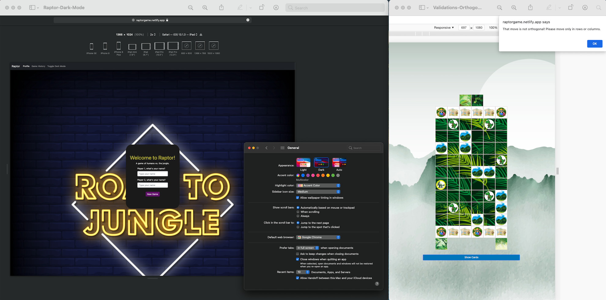

# Raptor

## Background
This app is a board game converted for play in a web browser. This simplifies setup and gameplay. The first iteration of the app will be hotseat play in the same session. Eventually, AI and remote play with a server can be supported.

## Game Overview
A group of scientists are on the hunt to capture three, live, baby raptors to study and then display in a brand new exhibit. A ferocious mother raptor will never let this happen. She'll either kill all the invading scientists, or hang on long enough to allow three of her babies to escape deep into the jungle, never to be found again.

## Getting Started:

### [Play the Raptor Early Access Release!](https://raptorgame.netlify.app/)

---

#### [Rules](markdown/rules.md)

Don't be daunted by the number of rules. Gameplay is pretty easy after a playthrough. The rules cover a bunch of different situations, but this is a summary of how you play:

1. Pick a team.
2. Place your pieces in their starting positions.
3. Pick a card.
4. Take your actions based on who goes first.
   1. Player 1: Do a special action on the card.
   2. Player 2: Use action points to take regular actions.
5. Game ends when [victory conditions](markdown/rules.md#end-of-the-game) are met.

#### Using the early access game

1. Enter your name and the name of someone to play hotseat with.
2. Click "Next" on the background.
3. Confirm you're "Ready" when you have reviewed the How to Play.
4. If you're player 1, pick a team (the other player will be assigned one).
5. Click "Play!" on the next screen (confirming your choice).
6. Drag and drop the raptor pieces onto the board according to the rules, and click "Confirm Placement".
   1. (Note: Only touch drag and drop is supported at the moment. To access on desktop use Chrome Dev Tools `cmd + opt + j` followed by `cmd + shift + m` and test with responsive device).
7. Drag and drop the scientist pieces onto the board according to the rules, and click "Confirm Placement".
8.  Click "Show Cards" to reveal your card choices.
9.  Click a card then click "Confirm Card"
10. Game development is still in progress so this is a preview with many improvements to come!

## Screenshots:

## Features
- MVC design
- Has theme
- Light/Dark mode
- Basic action validations

## Next Steps / Future Enhancements:
- [ ] Set up project in Jira or other task tracker for better organization for development
- [ ] Finish the game logic
- [ ] Refactor current code where difficult to read or not built to scale across the application
- [ ] Squash bugs
- [ ] Refine the UX
- [ ] Play against the computer
- [ ] Provide tooltips
- [ ] Provide playthrough tutorial
- [ ] Improve styling for playing pieces
- [ ] Improve styling for board
- [ ] Randomize board terrain
- [ ] Add user profiles
- [ ] Add game history to profiles
- [ ] Add single player campaigns
- [ ] Add server play
- [ ] Add expansions that include additional factions and expanded maps

## Pseudocode + Wireframes

- [Pseudocode in plan.md](markdown/plan.md)
- [Wireframes on Whimsical](https://whimsical.com/unit-1-project-game-raptor-UbVWrjmUwfCWsbGL3T4fVK)

## Technologies Used:
- HTML
- CSS
- JavaScript
- Bootstrap
- Animate.css

## Credits

##### Game Copyright
Raptor was designed by Bruno Cathala and Bruno Faidutti, and is copyright of [Matagot](https://www.matagot.com/).

[Buy the physical board game](https://www.matagot.com/shop/en/for-all/19-raptor-3760146641136.html?search_query=raptor&results=2) from Matagot (also distributed by Asmodee).

##### Images:

- [Raptor](https://unsplash.com/photos/-15ZMeUKtJM) by Mehmet Turgut Kirkgoz ([img](https://images.unsplash.com/photo-1606856110002-d0991ce78250?ixid=MnwxMjA3fDB8MHxwaG90by1wYWdlfHx8fGVufDB8fHx8&ixlib=rb-1.2.1&auto=format&fit=crop&w=1950&q=80))

##### Vecteezy Assets:

- <a href="https://www.vecteezy.com/free-vector/jungle">Jungle Vectors by Vecteezy</a>

- <a href="https://www.vecteezy.com/free-vector/raptor">Raptor Vectors by Vecteezy</a>

- <a href="https://www.vecteezy.com/free-vector/safari">Safari Vectors by Vecteezy</a>

- <a href="https://www.vecteezy.com/free-vector/nature">Nature Vectors by Vecteezy</a>

- [URLs to Specific Vecteezy Assets](markdown/vecteezy-asset-list.md)