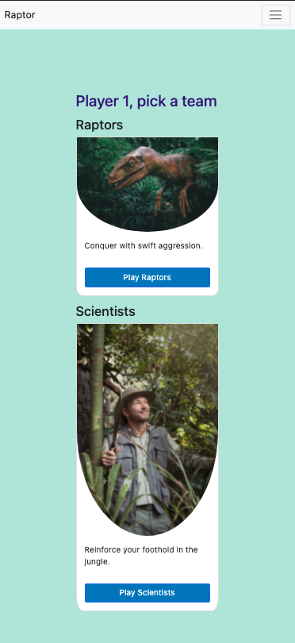

# Raptor

## Initial Schedule

By **Jun 25**, by 1hr before end of class:
- [x] Choose game
- [x] Wireframe main game screen (view on [Whimsical](https://whimsical.com/unit-1-project-game-raptor-UbVWrjmUwfCWsbGL3T4fVK))
- [x] Pseudocode gameplay

By **Jun 25**, by end of class:
- [x] Share GitHub repo

By **Jun 29**, end of class:
- [ ] Deploy game
- [ ] Present project
- Intro project (paraphrase README)
- Demonstrate project
  - Launch game from link in README
  - Play the game
- Discuss code
  - Briefly show HTML & CSS
  - Show the JS + fav function
- Share experience
  - What was the biggest challenge?
  - What are the key takeaways/learnings?

## Getting Started:

1. Go to the game: [MVP Game Link](https://raptorgame.netlify.app/).
2. Enter your name and the name of someone to play hotseat with.
3. Click "Next" on the background.
4. Confirm you're "Ready" when you have reviewed the How to Play.
5. If you're player 1, pick a team (the other player will be assigned one).
6. Click "Play!" on the next screen (confirming your choice).
7. Drag and drop the raptor pieces onto the board according to the rules, and click "Confirm Placement".
8. Drag and drop the scientist pieces onto the board according to the rules, and click "Confirm Placement".
9. Click "Show Cards" to reveal your card choices.
10. Click a card then click "Confirm Card"
11. Game development is still in progress so this is a preview with many improvements to come!

## Screenshots:

## Technologies Used:
- HTML
- CSS
- JavaScript
- Bootstrap

## Technical Requirements:
- [x] Renders a working game in browser
- [x] Win/loss logic and renders win/loss messages in HTML
- [x] Properly indented HTML, CSS, and JS with consistent vertical white space
- [x] Light/Dark mode
- [x] Uses CSS Flexbox/Grid
- [ ] Consistent and polished UI
- [x] No remaining dead or commented out code
- [x] Sensibly named functions and variables
- [x] Consistent code choices
- [x] Deployed online

## Features
- [x] MVC design
- [x] Has theme

## Next Steps / Future Enhancements:
- [ ] Finish the game logic
- [ ] Refine the UX
- [ ] Play against the computer
- [ ] Provide tooltips
- [ ] Provide playthrough tutorial
- [ ] Improve styling for playing pieces
- [ ] Improve styling for board
- [ ] Randomize board terrain
- [ ] Add user profiles
- [ ] Add game history to profiles
- [ ] Add single player campaigns
- [ ] Add server play
- [ ] Add expansions that include additional factions and expanded maps

## Background
This app is a board game converted for play in a web browser. This simplifies setup and gameplay. The first iteration of the app will be hotseat play in the same session. Eventually, AI and remote play with a server can be supported.

## Game Overview
A group of scientists are on the hunt to capture three, live, baby raptors to study and then display in a brand new exhibit. A ferocious mother raptor will never let this happen. She'll either kill all the invading scientists, or hang on long enough to allow three of her babies to escape deep into the jungle, never to be found again.

## How to Play
1. Pick a team.
2. Place your pieces in their starting positions.
3. Pick a card.
4. Take your actions based on who goes first.

## End of the Game
### Raptor Victory
- Three baby raptors escaped
  
  OR

- No more scientists on the board

### Scientist Victory
- Three baby raptors captured
  
  OR

- Mother raptor neutralized with 5 sleep tokens

## Rules
### General
- All gameplay is orthogonal (no diagonals).
- Only one piece or token per space.
- No piece can ever move through another piece, even if on the same team.
- Exits are only accessible to baby raptors. Baby raptors must use "Move a baby raptor" action to escape.
- Wounded mother raptor loses movement based on the number of times she has been hit.
- Scientists have unlimited ammunition and fire.
  
### Determine Who Goes First Each Round
- Lower cards go first and perform a special action.
- Higher cards go second and perform a regular action(s). 
- The number of available regular actions is the difference of the card values.
  - For example, a card with a value of 2 and a card with a value of 6 were played. 
  - The player who played the card with 2 performs its special action. 
  - Now, 6 - 2 gives the other player 4 regular action points to use.

### Take Action!
- Each regular action for raptors and scientists costs ONE (1) action point.
- For determinining the number of actions you can take, see "Determining Who Goes First Each Round".
- Only active pieces can take actions.
- You can choose to not use regular actions.
- Only ONE (1) aggressive action (put to sleep, capture, or shoot) per scientist per round.
- Fire:
  - Raptors can never move to or through fire.
  - Scientists can move and shoot through fire, but cannot end their movement in fire.
  - When the mother raptor removes fire, all adjacent (connected) fire is removed.
  - When scientists drive a jeep through fire, it removes the fire.
- Frightened and Sleep:
  - Baby raptors cannot be revived the same round they were put to sleep.
  - Frightened scientists cannot be revived the same round they were frightened.
- Reinforcements (scientists):
  - Scientists have a fixed number of reinforcements; you can never receive more scientists than in your reserve.
  - Reinforcements can only be placed on the edge of the board, and never in the L-shaped tiles.
- Recovery (raptors):
  - The effect of cards 5 and 7 can be split between the mother and baby raptors.
- Kills:
  - When a scientist dies, it is removed from the game.

#### Raptor Actions
##### Regular Actions
Each regular action costs 1 action point.
- Move a baby raptor
- Move the mother raptor
- Kill a scientist
- Wake up a baby raptor
- Put out a fire
##### Special Actions
- Card 1: Mother's Call and Shuffle
  - Actions:
    1. Move active baby raptor to free space on tile where mother raptor is located.
  - Notes:
    - Shuffles your deck
    - Babies already on tile can go to another space on the same tile.
    - Babies cannot move through obstacles. 
- Card 2: Disappearance and Observation
  - Actions:
    1. Remove mother raptor from board.
    2. Wait for scientist to spend action points.
    3. Place mother raptor back on board.
  - Notes:
    - Next round, see what card the scientists plays before you choose yours.
- Card 3: Fear
  - Actions:
    1. Frighten one scientist
  - Notes:
    - Scientist is inactive until revived
    - Scientists cannot be revived the same round they were put to sleep
- Card 4: Mother's Call (x2)
  - Actions:
    1. Move one or two baby raptors to free space on the tile where the mother raptor is located
  - Notes:
    - Babies on the same tile can move to a new space
    - There must be an open path for the babies to follow
- Card 5: Recovery (x2)
  - Actions:
    1. Heal the mother raptor two times, wake up two babies, or do one of both
- Card 6: Disappearance and Observation
  - Actions:
    1. Remove the mother raptor
    2. Wait for the scientist to use action points
    3. Place the mother raptor back on a space
  - Notes:
    - Next round, the raptors get to see what card the scientist will play before revealing theirs.
- Card 7: Recovery (x3)
  - Actions:
    1. Heal the mother raptor three times, wake up three babies, or do a combination of each.
- Card 8: Fear (x2)
  - Actions:
    1. Frighten one or two scientists
  - Notes:
    - Scientist(s) are inactive until revived
    - Scientists cannot be revived the same round they were put to sleep
- Card 9: No effect
#### Scientist Actions
##### Regular Actions
Each regular action costs 1 action point.

*Each scientist gets only ONE aggressive action per round.
- Move a scientist
- Stand a scientist back up
- Put a baby raptor to sleep*
- Capture a sleeping baby raptor*
- Shoot the mother raptor*
##### Special Actions
- Card 1: Sleeping Gas and Shuffle
  - Actions:
    1. Put a baby raptor to sleep
  - Notes:
    - Shuffles your deck
    - Only works if the scientist is on the same or an adjacent tile to the baby
    - Baby raptor cannot be awakened until next round
- Card 2: Reinforcements
  - Actions:
    1. Place one or two scientists from the reserve on empty spaces located along the long edges of the board
  - Notes:
    - L-shaped tiles are not permissable landing zones
    - If you have no scientists left, you're out of reinforcements and do nothing this round!
- Card 3: Jeep (x2)
  - Actions:
    1. Move one or two scientists with a Jeep.
  - Notes:
    - The same scientist may move twice
    - Jeep movement:
      - Move as many spaces as you like in an unobstructed straight line
      - Moving through fire removes it
- Card 4: Sleeping Gas (x2)
  - Actions:
    1. Put one or two baby raptors to sleep
  - Notes:
    - Only works if the scientist is on the same or an adjacent tile to the baby
    -  Baby raptors cannot be awakened until next round
- Card 5: Fire (x2)
  - Actions:
    1. Place two fire tokens on free spaces on the board
  - Notes:
    - Can only be placed adjacent to a scientist or another fire token
- Card 6: Reinforcements
  - Actions:
    1. Place one or two scientists from the reserve on empty spaces located along the long edges of the board
  - Notes:
    - L-shaped tiles are not permissable landing zones
    - If you have no scientists left, you're out of reinforcements and do nothing this round!
- Card 7: Fire (x3)
  - Actions:
    1. Place three fire tokens on free spaces on the board
  - Notes:
    - Can only be placed adjacent to a scientist or another fire token
- Card 8: Jeep (x4)
  - Actions:
    1. Move up to four scientists with a Jeep.
  - Notes:
    - The same scientist may move as many times as available
    - Jeep movement:
      - Move as many spaces as you like in an unobstructed straight line
      - Moving through fire removes it
- Card 9: No effect

## Credits

Raptor was designed by Bruno Cathala and Bruno Faidutti, and is copyright of [Matagot](www.matagot.com).

[Buy the physical board game](https://www.matagot.com/shop/en/for-all/19-raptor-3760146641136.html?search_query=raptor&results=2) from Matagot (also distributed by Asmodee).

Images used:
- [Jungle](https://unsplash.com/photos/NbPaOTi0DJ4) by Michael Hystead ([img](https://images.unsplash.com/photo-1610227514387-d50bbb97d1c8?ixid=MnwxMjA3fDB8MHxwaG90by1wYWdlfHx8fGVufDB8fHx8&ixlib=rb-1.2.1&auto=format&fit=crop&w=1950&q=80))
- [Raptor](https://unsplash.com/photos/-15ZMeUKtJM) by Mehmet Turgut Kirkgoz ([img](https://images.unsplash.com/photo-1606856110002-d0991ce78250?ixid=MnwxMjA3fDB8MHxwaG90by1wYWdlfHx8fGVufDB8fHx8&ixlib=rb-1.2.1&auto=format&fit=crop&w=1950&q=80))
- [Scientist](https://unsplash.com/photos/vGzmLshPjbc) by Peter Larsen ([img](https://images.unsplash.com/photo-1584696993692-a53190f76609?ixid=MnwxMjA3fDB8MHxwaG90by1wYWdlfHx8fGVufDB8fHx8&ixlib=rb-1.2.1&auto=format&fit=crop&w=3334&q=80))

Icons used:
- raptor by parkjisun from the Noun Project [link](https://thenounproject.com/search/?q=raptor&i=411120)
- dinosaurs by Sumana Chamrunworakiat from the Noun Project [link](https://thenounproject.com/search/?q=raptor&i=1439055)
- folk by Gan Khoon Lay from the Noun Project [link](https://thenounproject.com/search/?q=man+in+safari+hat&i=1244253)